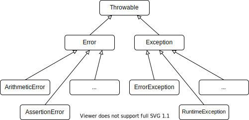

# Errors und Exceptions

PHP ist eine Programmiersprache mit einer langen Geschichte. Die Fehlerbehandlung ist daher zweigeteilt in *Errors* (im folgenden Fehler gennannt) und *Exceptions*. Fehler kommen aus der Zeit vor der Objektorientierten Programmierung und Exceptions wurden mit der Objektorientierten Programmierung eingeführt.

PHP hat einen eher "lockeren" Umgang mit Fehlern im Programmablauf. PHP unterscheidet zwischen unterschiedlichen Schweregraden von Fehlern. Nicht in allen Schweregraden wird der Programmablauf gestoppt, sondern die PHP Laufzeitumgebung versucht das Programm weiter auszuführen.

Eine Exception hingegen führt immer dazu, dass der Programmablauf gestoppt wird. Ein PHP-Programm kann so angepasst werden, dass Fehler in Exceptions überführt werden. Dies ist eine gängige Praxis in der modernen PHP Entwicklung (zB in Laravel oder Symfony).

## Schweregrade von Fehlern

PHP identifiziert die unterschiedlichen Schweregrade von Fehlern über Konstanten. Die wichtigsten sind folgende:

 - `E_ERROR`: Fataler Laufzeitfehler, PHP kann die Programmausführung nicht mehr fortführen und der gesamte Programmablauf wird gestoppt. __Eine Exception ist immer ein `E_ERROR`!__
 - `E_WARNING`: Warnungen sind fehlerhaftes Programmverhalten, aber keine fatalen Laufzeitfehler, welche die Ausführung nicht stoppen.  
 - `E_NOTICE`: Hinweise welche im weiteren vielleicht zu einem fatalen Laufzeitfehler führen können.

Alle verfügbaren Konstanten sind inder [PHP Dokumentation](https://www.php.net/manual/en/errorfunc.constants.php) zu finden.

### Fehler Beispiele

#### E_ERROR

```php
<?php
$obj = new NonExistingClass();
```

Es wird versucht eine Instanz der Klasse `NonExistingClass` zu erzeugen. Die Klasse existiert nicht. Das Programm erzeugt einen `Fatal Error` (E_ERROR) und wird abgebrochen:

```
PHP Fatal error:  Uncaught Error: Class 'NonExistingClass' not found in C:\example\error.php:3
Stack trace:
#0 {main}
  thrown in C:\example\error.php on line 3
``` 

#### E_WARNING

```php
<?php
$file=fopen("non_existing_file.txt","r");
```

Das Programm wird nicht gestoppt, obwohl eine Datei eingelesen werden sollte, welche nicht existiert. Je nachdem wie die Variable `$file` weiter genutzt wird, kann das Programm natürlich in einem fatalen Fehler resultieren:

```
PHP Warning:  fopen(non_existing_file.txt): failed to open stream: No such file or directory in C:\example\error.php on line 2
```

#### E_NOTICE

```php
<?php
$sum = 3 + $a;
echo $sum;
```

Das Programm wird nicht gestoppt, obwohl eine Variable `$a` verwendet wird, welche nicht definiert wurde. Je nachdem wie die Variable `$sum` weiter genutzt wird, kann das Programm natürlich in einem fatalen Fehler resultieren:

```
PHP Notice:  Undefined variable: a in C:\example\error.php on line 2
3
```

## Error Reporting

Innerhalb der `php.ini` wird über die Direktive `error_reporting` angegeben, welche Fehler ausgegeben werden sollen. Die Fehlerausgabe ist wichtig während der Entwicklungszeit jedoch im Produktivbetrieb sollten keine Fehler preisgegeben werden, da diese Informationen aus Sicherheitsgründen verborgen bleiben sollten. 

Innerhalb von PHP-Skripten kann der in der `php.ini` gesetzte Wert für `error_reporting` auch überschrieben werden. Dazu kann die gleichnamige Funktion `error_reporting` verwendet werden. Im folgenden wird exemplarisch gezeigt wie das Error Reporting innerhalb eins PHP-Skripts konfiguriert werden kann:

```php
<?php

// Das gesamte Error Reporting ausschalten
error_reporting(0);

// Alle Fehler werden über Error Reporting ausgegeben
error_reporting(E_ALL);

// E_WARNING oder E_NOTICE Fehler ausgeben sonst alles verschweigen
error_reporting(E_WARNING | E_NOTICE);

// Alle Fehler außer E_ERROR (fatale Fehler) sollen ausgegeben werden
error_reporting(E_ALL & ~E_ERROR);
```

## Exceptions

Mit der Einführung der Objektorientierten Programmierung wurden auch `Exceptions` und `try-catch Blöcke` in PHP eingeführt. Die Herausforderung mit Exceptions liegt darin, dass ein Großteil der built-in PHP Funktion Fehler werfen und keine Exceptions. Neuere Objektorientierte Bestandteile der PHP Standard Library hingegen werfen Exceptions und keine Fehler.

### Exception Hierarchie

Die Elternklasse aller PHP Exceptions ist `Throwable`. Des weiteren gibt es eine Zweiteilung in `Error` und `Exception` Exceptions (`Error` ist eine Exception mit Klassenname `Error`). `Error` ist die Elternklasse alle PHP Fehler die intern in Exceptions überführt werden. `Exception` ist die Elternklasse aller Exceptions, für eigene Exceptions sollte man diese Klasse als Elternklasse verwenden. 



### Try-catch Blöcke

`Try-catch Blöcke` können, wie aus anderen Programmiersprachen bekannt, verwendet werden:

```php
<?php

try
{
    // Beliebiger Code, welcher in einem try-catch Block abgewickelt werden soll
}
catch(DivisionByZeroError $e)
{
    // ZB den Division durch 0 Fehler bearbeiten
}
catch(ArgumentCountError $e)
{
    // ZB den falsche Anzahl an Funktionsargumenten Fehler bearbeiten
}
finally
{
    // Finally wird immer ausgeführt, egal ob es sich um eine Exception handelt oder nicht...
}
```

## Error Handler

Für ein PHP-Programm kann ein sog. Error Handler angegeben werden, welcher ausgeführt wird nachdem ein entsprechender Fehler aufgetreten ist. Damit kann die Entwicklerin bestimmen was beim Auftreten eines Fehlers im Programm passieren soll.

An die Funktion `set_error_handler` kann eine Funktion übergeben werden, welche beim Auftreten eines Fehler ausgeführt wird. PHP übergibt das Error Handling komplett an diese eigens definierte Funktion. 

Die moderne Praxis überführt einen PHP Error in eine sog. `ErrorException`. Somit werden alle Fehler in fatale Laufzeitfehler überführt (`E_ERROR`), da Exceptions immer fatale Laufzeitfehler sind. 

```php
<?php

set_error_handler(function($severity, $message, $file, $line) {
    throw new ErrorException($message, 0, $severity, $file, $line);
});
```

## Exception Handler

Analog zum Error Handler kann ein Exception Handler definiert werden. Der Exception Handler wird immer dann ausgeführt, wenn eine Exception nicht `getcatcht` wurde (Nicht über einen `try-catch Block` verarbeitet). Alle Exceptions die durch den "Rost fallen" können dadurch behandelt werden. Damit kann unter anderem sicher gestellt werden, dass keine Fehler für Benutzer sichtbar werden.

Mit der Funktion `set_exception_handler` kann eine Funktion als Exception Handler übergeben werden. Die Funktion bekommt die entsprechende Exception übergeben:

```php
<?php

set_exception_handler(function(Throwable $e) {
    // Reaktion auf Exception ...
});
```
