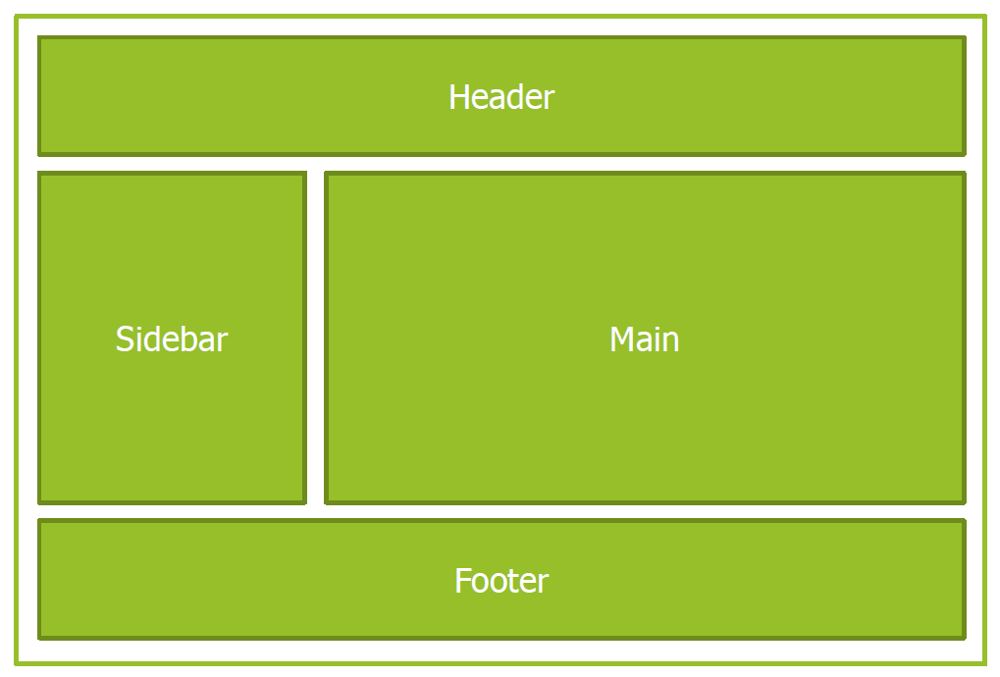

# Quellcode einbinden

Web-Applikationen bestehen auf vielen Quellcodedateien. PHP bietet unterschiedliche Mechanismen um die entsprechenden Dateien zu einzubinden. Anders als in JAVA muss sich die Entwicklerin um das Einbinden der ensprechenden Quellcodedateien kümmern.

## Require/Include

PHP bietet die Ausdrücke `include` und `require` um andere PHP-Dateien in einer PHP-Datei einzubinden. Beim Einbinden wird eine Datei nicht nur eingelesen sondern vom PHP-Interpreter auch ausgeführt. Der Unterschied von `include` zu `require` besteht darin, dass `include` nur ein Warning erzeugt und `require` einen Fehler wirft (Programm Stop), falls eine Datei nicht existiert.

Des weiteren gibt es auch die Ausdrücke `include_once` und `require_once` um zu verhindern, dass eine Datei mehrfach eingebunden wird.

!!! info
    Generell sollte der Ausdruck `require_once` zum Einbinden von Dateien verwendet werden:
    
    1. Mehrfacheinbinden der selben Datei wird unterbunden
    2. Fehler werden sichbar da es zum Programm Abbruch kommt und können von der Entwicklerin behoben werden

    Außer man will Fehlerbehandlung mit Exceptions durchführen, dann sollte `include_once` verwendet werden. `require_once` erzeugt einen `E_COMPILE_ERROR`, welcher nicht in eine Exception überführt werden kann, da dieser zur "Kompilierzeit" in der Programmausführung stattfindet.

## Aufbau einer Website

Eine Website besteht generell aus Bestandteilen die sich auf allen Unterseiten wiederfinden. Wiederverwendbare Teile können über `require_once` eingebunden werden.



Das oben gezeigte Grundgerüst einer Website würde über folgendes PHP-Skript nachempfunden:

```php
<?php require_once 'header.php'; ?>

<aside>
    <?php require_once 'sidebar.php'; ?>
</aside>

<main>
    <h1>News Artikel</h1>
    <p>bla bla ...</p>
</main>

<?php require_once 'footer.php'; ?>
```

## Class-Autoloader

Eine Web-Applikation kann aus vielen Klassen bestehen. Es ist sinnvoll jede Klasse innerhalb einer eigenen Datei zu hinterlegen. Um nicht jede einzelne Klasse einzeln über einen `require_once` Aufruf einbinen zu müssen, gibt es sog. Autoloader.

Ein Autoloader ist eine Funktion, welche von der PHP-Laufzeitumgebung ausgeführt wird, falls eine Klasse nicht gefunden wurde (Noch nicht eingebunden wurde!). Mit der Funktion kann das entsprechende Einbinden dann ausgeführt werden.

Mittels der Funktion `spl_autoload_register` Funktion kann ein entsprechender Autoloader für die PHP-Laufzeitumgebung definiert werden (`spl` steht für Standard PHP Library).

Im folgenden Beispiel wird werden alle Klassen der Applikation im Ordner `classes` abgelegt. Jede Klasse wird innerhalb einer Datei abgelegt, welche den selben Namen als die Klasse hat, jedoch komplett in Kleinbuchstaben:

```php
<?php

spl_autoload_register(function($classname) {
    $filename = strtolower($classname);
    require_once "classes/" . $filename . ".php";
});
```
