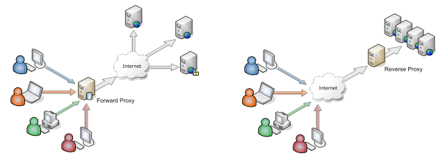

# Wichtige Funktionen

## Virtual Hosting

Virtual Hosting ist eine Methode um mehrere Web-Anwendungen oder Websites über einen Web-Server abzubilden. Dabei sind 2 Vorgehensweisen zu unterscheiden:

 - **Name-based Virtual Hosting:** Mehrere DNS-Einträge zeigen auf die selbe IP-Adresse auf der ein Web-Server ausgeführt wird. In HTTP-Requests wird der Host-Header mitgesendet. Über diesen Header kann am Web-Server der zugehörige Virtual Host ausgewählt werden. Die ist die häufigste Form von Virtual Hosting, welche auch als Shared Hosting von Providern angeboten wird.
 - **IP-based Virtual Hosting:** Ein Web-Server kann so konfiguriert sein, dass er über mehrere IP-Adressen angesprochen werden kann. Dies kann zum Beispiel über mehrer physiche Netzwerk-Interfaces oder mehreren virtuellen Netzwerk Interfaces auf dem Rechner durchgeführt werden. Je nach IP-Adresse wird ein anderer Virtual Host aktiviert. Dies ist eher ein seltener Fall im Gegensatz zum Name-based Virtual Hosting. 

## Proxy

Als Proxy wird generell ein Intermediär zwischen Client und Server bezeichnet. Proxies sind ein wichtiger Bestandteil des WWW. Es werden für das WWW generell 2 Arten von Proxies unterschieden:

 - **Forward Proxy:** HTTP-Requests werden über einen Forward Proxy geleitet. Dadurch können eine Vielzahl von Funktionen realisiert werden: Caching, Blockieren von Seiten, Firewall, Identität verändern (Puls4 in Deutschland streamen), etc. Der Web-Client muss den Proxy explizit konfigurieren.
 - **Reverse Proxy (aka Gateway):** HTTP-Requests gehen ein öffentliches Ziel, welcher ein Proxy ist. Der Proxy verteilt die HTTP-Requests nach konfigurierten Regeln an weitere Web-Server zur Verarbeitung. Einsatzzwecke für Reverse Proxies sind zum Beispiel Load Balancing oder die Bereitstellung von Ressourcen nach Außen, welche hinter einer Firewall liegen. Am Web-Client müssen dafür keine Konfigurationen durchgeführt werden. 

## Common Gateway Interface (CGI)

CGI ist ein Protokoll, welches von Web-Servern genutzt wird, um mit der Ausführungsumgebung (zB PHP) zu kommunizieren. Der Ablauf ist generell wie folgt spezifiziert:

 - Der Web-Server bekommt den HTTP-Request übergeben.
 - Über das CGI-Interface wird der HTTP-Request an die PHP-Laufzeitumgebung übergeben. Variablen, welche vom Web-Server an das Programm (über CGI) übergeben werden, sind über das CGI-Interface definiert. Ein Großteil der Einträge in der PHP `$_SERVER` Superglobal kommen aus dem CGI-Interface (zB 'QUERY_STRING', 'REMOTE_ADDR', 'SERVER_PROTOCOL').
 - Alle Ausgaben, welche über die Standardausgabe gemacht werden (zB echo in PHP), werden direkt in den HTTP-Response Body übergeben.

Das Protokoll wurde 1997 in Version 1.1 im RFC 3875 standardisiert. Das Standard-CGI startet für jeden eingehenden HTTP-Request einen eigenen Prozess, welcher zur Abarbeitung verwendet wird, nach der Bearbeitung wird der Prozess wieder beendet. Dies erzeugt einen deutlichen Overhead, deshalb wurden viele Abwandlungen und Erweiterungen des Protokolls durchgeführt:

 - **FastCGI:** FastCGI wird als Dienst ausgeführt und arbeitet eingehende Anfragen vom Web-Server ab. Es ensteht dabei kein Overhead für die Prozess Wiederverwendung.
 - **SCGI:** SCGI ist das Simple CGI-Interface das ähnlich zu FastCGI funktioniert, aber einige Vereinfachungen durchführt, sodass eine Implementierung einfacher durchzuführen ist.
 - **Eigene Implementierungen:** Rack (Ruby Web-Server Interface), WSGI (Python Web-Server Gateway Interface) oder JSGI (JavaScript Web-Server Gateway Interface) sind spezifische Implementierungen von CGI für unterschiedliche Programmiersprachen. 

!!! info "Info"
    Nginx kann Web-Anwendungen, welche mit PHP programmiert wurden, über das FastCGI Interface ausführen. Für den Apache Webserver wurde ein eigenes Modul für die Ausführung von PHP entwickelt (`mod_php`).
