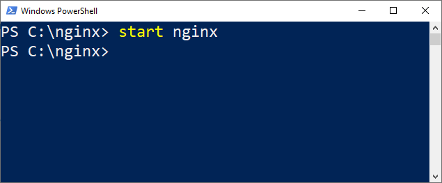
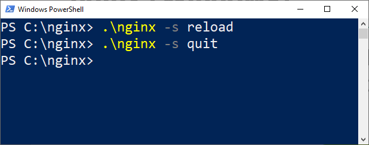

# Nutzung Nginx

## Installation (Windows)

Unter [Downloads](https://nginx.org/en/download.html) findet man auch eine Windows Version von Nginx. Es soll die `Stable Version` des Nginx für Windows heruntergeladen werden. Der Download besteht aus einem Zip-Archiv. Das Zip-Archiv kann in den Ordner `C:\nginx` entpackt werden.

## Nutzung

!!! danger "Wichtig"
    Windows blockiert Port 80 gerne mit eigenartigen Diensten. Ein gängiges Problem ist ein ominöser `http` Dienst unter Windows. Dieser kann innerhalb einer als Administrator ausgeführten Powershell mit `net stop http` beendet werden. Andere Probleme/Lösungen können zum Beispiel [hier](https://stackoverflow.com/questions/788348/how-do-i-free-my-port-80-on-localhost-windows) gefunden werden.

Alle Befehle zur Verwaltung von Nginx müssen im Ordner `C:\nginx` ausgeführt werden. Vorausgesetzt das der Web-Server wie oben entpackt wurde.

### Starten

Durch die Angabe von `start` wird der entsprechende Befehl als Hintergrundprozess gestartet. Auch nachdem Schließen der Powershell bleibt dieser am Laufen.

### Signale senden

Falls Nginx als Hintergrundprozess gestartet wurde, können Signale an den Prozess gesendet werden. Folgende Signale werden unterstützt:

 - `stop`: Beendet Nginx sofort
 - `quit`: Arbeitet noch alle offenen HTTP-Requests ab und beendet Nginx dannach
 - `reload`: Neuladen der Konfiguration
 - `reopen`: Log-Files neu öffnen

Signale werden über das `nginx` Command an den Prozess gesendet:

